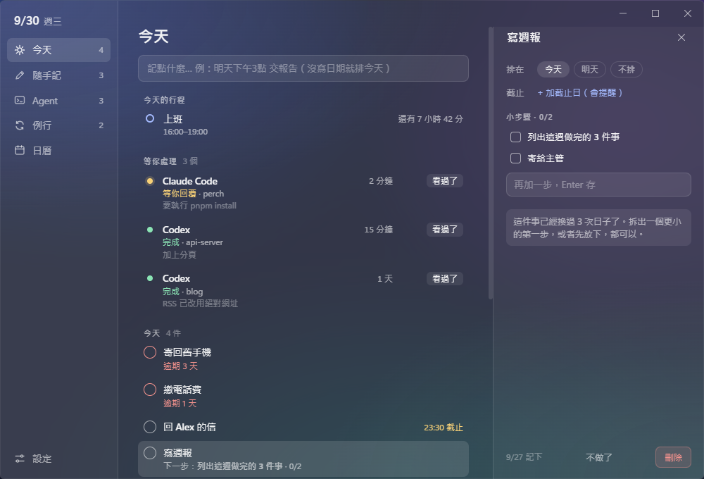
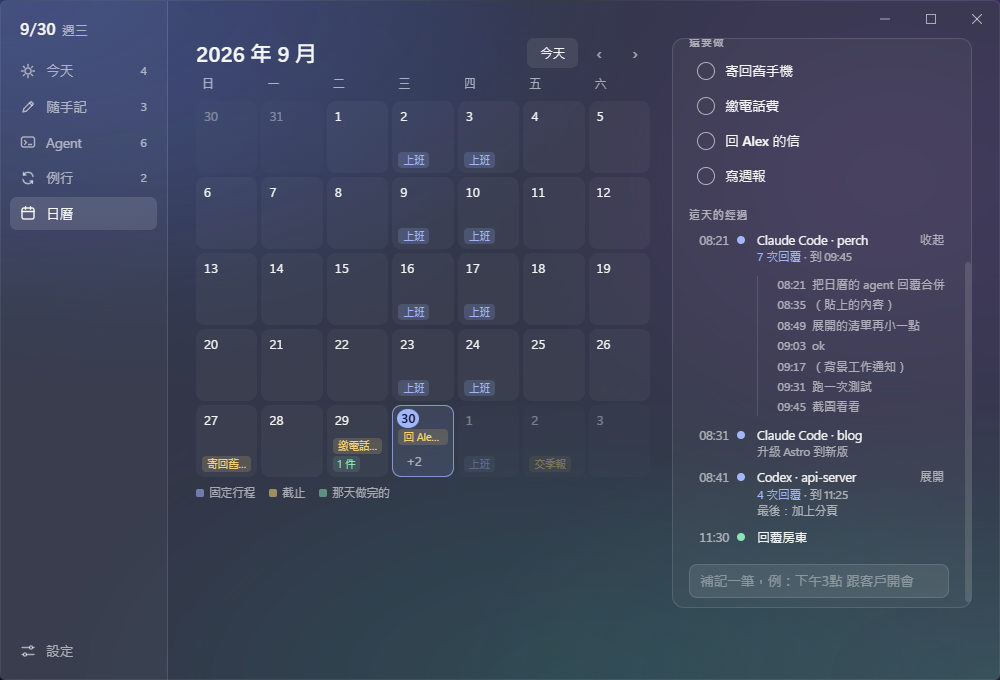
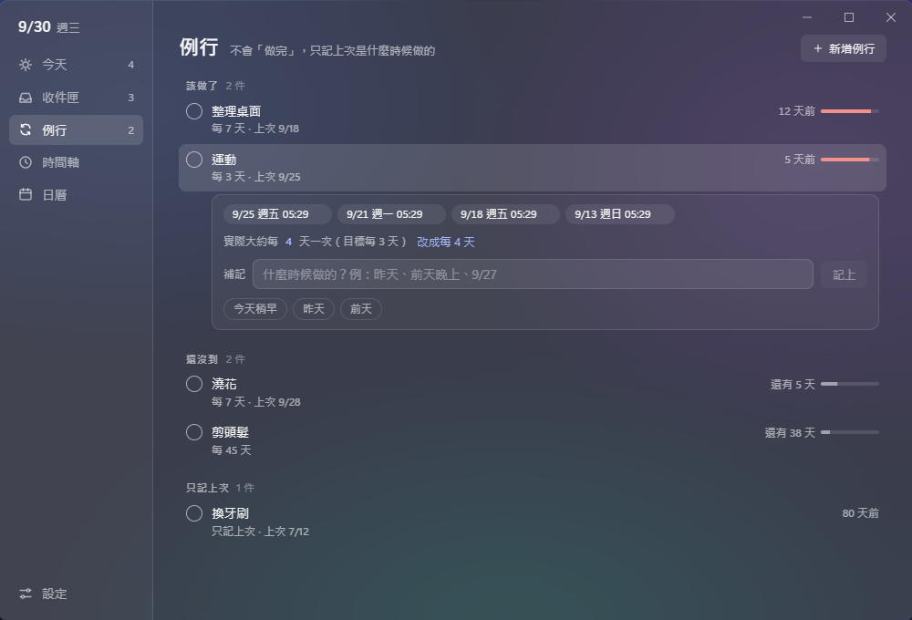

# Perch

A local-first desktop reminder for people who run AI coding agents.

A small glass window perches on your desktop and shows only what needs you **now**: today's fixed schedule, agents that finished or are waiting for your answer, today's work with its next step, and routines you have not done for a while. A main window keeps the rest — what you jotted down, every agent session, routines and their history, and a calendar of what happened and what is coming.

> Early version. Made and used on Windows; macOS and Linux builds are produced by CI and have not been tried on real machines yet. The interface is in Traditional Chinese.




## What it does

- **Agents come back to you.** Hooks for Claude Code, Codex, Grok Build and OpenCode report when a session finishes, fails or waits for input. You get a notification, and the session stays in the float until you mark it seen. The **Agent** tab keeps every session of the week — what it was asked, what came back — and a **回去** button copies the command that reopens it in its folder.
- **A float with three tabs.** **待辦**: today with what is already done, routines due, what comes later and the newest ideas; click a title to rename it, move it or delete it right there. **Agent**: who waits on you and who is still running. **暫存**: memos you wrote and things you pasted to keep. **控制台** opens the main window.
- **Where every project was left.** The **專案** tab sorts the folders your agents worked in by when you last touched them, with what you last asked and how it went; folders left alone for three days or more turn amber. One click opens the folder.
- **Agents can leave you work.** **記下來** on an agent card turns its last line into your own task, filed under its project. Agents can also run `perch-hook add "明天 確認 macOS 版能打開"` themselves; 設定 → 讓 agent 記進 Perch has the lines to paste into `CLAUDE.md` or `AGENTS.md` (Perch never edits those files).
- **暫存 (stash).** Write a memo in the box at the top (Enter saves, Shift+Enter starts a new line), or paste text, links or pictures with `Ctrl+V` and drag pictures in; `#tags` sort them. A memo you wrote is kept for good. What you pasted goes when you have not used it for 30 days (7, 30, 90 days or never in 設定 → 資料), unless you press **保留**. Perch never records the clipboard on its own.
- **Claude Code usage limits.** With the optional status line (設定 → Agent 連線 → 額度), the Agent tab shows how much of the 5-hour and 7-day limits is used and when they reset; the float mentions it only once the 5-hour window passes 80%. Needs a Pro or Max plan.
- **Capture without friction.** `Ctrl+Alt+N` anywhere opens a one-line box (設定 → 快速記錄 changes the keys). Dates are read from what you type, in Chinese or English: `明天下午3點 交報告`, `週五`, `10/2 17:00`. Lines without a date wait in **隨手記** until you give them a day.
- **Fixed schedules.** Work shifts or classes at fixed weekly times ("週三 16:00–19:00, 週四 18:30–21:30"), each day with its own hours. They show on today's list with a countdown and remind you 30 minutes before (adjustable). Typing `每週四 18:30-21:30 上班`, `每週一到五 9:00-18:00` or `每天 晚上10點 寫日記` in any capture box makes one.
- **A real calendar.** The month at a glance, like the Windows tray calendar. Pick a day to see what happened (a timeline and a summary, with an agent's many replies in one project folded into one line), fill in what you forgot, or plan something for a day ahead.
- **Shut down later (Windows).** The power button in the float shuts the computer down in 30 minutes to 3 hours, at a time you type (`23:30`), or once every NVIDIA GPU has stayed at or below 10% for 3, 5, 10 or 15 minutes, for example when a ComfyUI render finishes. A 60-second countdown with **取消關機** comes first, and Perch asks Windows for a normal shutdown (`shutdown /s /t 0`, never forced), so a program with unsaved work can still stop it. A failed GPU reading never counts as idle, and a time missed while the computer slept is dropped rather than run on waking. The plan lives only while Perch runs.
- **On your phone (Android, through Tailscale).** 設定 → 手機 (off by default) lets a paired phone see the computer, the GPU, agents waiting or running and today's list, write to 今天 / 隨手記 / 暫存, and plan or cancel a shutdown (it still counts down 60 seconds on the computer). Every notification Perch shows is also pushed to phones that turned notifications on. Perch listens on 127.0.0.1 only; [Tailscale](https://tailscale.com) on both devices brings the phone in over HTTPS (`tailscale serve`), at home and away. Pairing is a one-time QR code; each phone gets its own key (the computer keeps only a hash) and can be removed in 設定. The page is added to the home screen from Chrome; pushes go through Google's push service, encrypted.
- **A note for each day.** Write a line or a page about the day in the calendar; it saves as you type. Optionally Perch writes each day — the note, what got done, what happened — into an [Obsidian](https://obsidian.md) vault as `Perch/<date>.md` (設定 → 資料 → Obsidian).
- **Start instead of finish.** Break a task into small steps; the float shows the next one. **先做 5 分鐘** starts a five-minute timer on it — no pop-up when it ends, no failure state.
- **Honest but gentle.** Overdue work is shown as it is, with calm ways out: move it, take the date away, or **不做了** (let it go without deleting it).
- **"When did I last…?"** Routines either have a goal ("every 3 days", the float reminds you) or only remember the last time (never nags). Each one keeps its history; you can record a time after the fact ("昨天", "前天晚上").
- **Glass that stays readable.** A navy-tinted glass that works over bright windows as well as dark wallpapers; 設定 → 玻璃濃淡 picks how strong it is.
- **Your data stays yours.** A copy of the database is kept every day and before an update changes it. 設定 → 匯出 writes everything as JSON (complete) and Markdown (readable).
- **Updates when you ask.** 設定 → 檢查更新 looks for a newer release on GitHub and downloads it; 重開更新 installs it, or it installs the next time Perch quits.
- **Nothing leaves your computer.** No account, no server, no network port. The only time Perch goes online is when you press 檢查更新.





## Install

Everything is on the [Releases](https://github.com/Rinne414/perch/releases) page, or build it yourself (see below). Nothing is code-signed yet, so each system warns the first time:

- **Windows**: run `Perch-Setup-<version>.exe`. At "Windows protected your PC", choose **More info → Run anyway**. Later versions come through 設定 → 檢查更新; until the installer is signed, a downloaded update is checked against the SHA-512 checksum published with the release.
- **macOS** (Apple silicon and Intel): open `Perch-<version>-mac.dmg` and drag Perch to Applications. The first time, macOS refuses to open it; go to System Settings → Privacy & Security and choose **Open Anyway**. 檢查更新 tells you about a new version and opens this page; macOS only lets signed apps replace themselves.
- **Linux**: the `.AppImage` (make it executable, then run it) updates itself through 檢查更新; the `.deb` is updated by installing the new one. On GNOME the tray icon needs the AppIndicator extension. Without a system blur the window is a solid dark blue instead of glass.

設定 → 開機時啟動 starts Perch with the system (on Linux it adds `~/.config/autostart/io.github.rinne414.perch.desktop`).

### Connect your agents

Open the main window (tray menu → 開啟主視窗) → **設定**, then press **安裝** next to each agent.

- This edits the agent's own config (`~/.claude/settings.json`, `~/.codex/hooks.json`, …) and keeps a backup next to it as `*.perch.bak`. **移除** takes our entries out again and leaves everything else as it was.
- The hooks run `node`, so [Node.js](https://nodejs.org) 20 or newer must be on your `PATH` (OpenCode uses a plugin and does not need it).
- **Codex** only runs hooks you trust: after installing, run `/hooks` inside Codex once and trust `perch`.
- **Claude Code usage (額度)** is a separate switch. Claude Code only hands its usage limits to its status line command, so Perch sets `statusLine`. If you already have one (ccstatusline, a script of your own), Perch wraps it: it notes the usage, then runs yours with the same input and prints exactly what yours printed, so Claude Code looks the same as before; **移除** puts yours back as it was. Without one, Perch's shows `5h 23% · 7d 41%` under the prompt.
- Gemini CLI can be installed but has not been verified yet.

### Other agents

Anything can report to Perch by writing a JSON file into the inbox folder (`%APPDATA%\Perch\inbox`). The format is public and versioned — see [`src/shared/agentEvent.ts`](src/shared/agentEvent.ts):

```json
{ "v": 1, "agent": "my-agent", "sessionId": "abc123", "status": "done", "cwd": "C:\\code\\app", "title": "fix the login page" }
```

`status` is one of `running`, `needs_input`, `done`, `failed`, `cancelled`. Write to a temporary name first and rename it to `*.json`, so the app never reads half a file.

To leave the person something to do, write an item instead; `title` is read like the capture box, so a date in it makes a dated task and anything else waits in 隨手記, filed under the project in `cwd`:

```json
{ "v": 1, "kind": "item", "agent": "my-agent", "title": "明天 確認 macOS 版能打開", "cwd": "C:\\code\\app" }
```

`node perch-hook.js add "<text>" --inbox <inbox folder>` writes one for you, with the folder it runs in as `cwd`.

## Your data

Everything lives in Perch's data folder — `%APPDATA%\Perch` on Windows, `~/Library/Application Support/Perch` on macOS, `~/.config/Perch` on Linux: a SQLite database (`tasks.db`), the agent inbox, `backups` and `logs`. From an agent report Perch keeps the status, the project folder, the first line of your prompt as a title, and one line of detail (the agent's last reply, what it is waiting for, or the error). 設定 → 按來源清除資料 deletes everything one agent wrote.

- **Backups.** `backups\tasks-<date>_<time>.db` once a day (the last 7 are kept), and `…-before-update.db` right before a new version changes the database (the last 3). To go back to one, quit Perch from the tray, delete `tasks.db`, `tasks.db-wal` and `tasks.db-shm`, and copy the backup in as `tasks.db`.
- **Log.** `logs\perch.log` records errors and app events (start, update, backup), never task titles or prompts. 設定 → 回報問題 opens a GitHub issue with the version filled in; read the log before attaching it.
- **Export.** The JSON holds every item, the whole timeline, the agent sessions, the day notes and 暫存 (times in Unix milliseconds, `"format": 1`); the Markdown is the same for reading, and the stashed pictures are copied into a folder next to it.
- **暫存 pictures** are files in `clips\<year-month>\`, the rest is in the database. A deleted or cleared picture waits in `clips\.deleted` for 8 days, so restoring a week-old backup still finds it.
- **Obsidian.** Perch only writes inside the `Perch` folder of the vault you pick, one file per day, and rewrites a file only when that day changed. It is one way: edits made in Obsidian are not read back. If the vault syncs to a cloud, so do these notes (they include the first lines of your agent prompts).
- **Claude Code usage** is kept in `inbox/quota/claude-code.json`: the used percentages and reset times, nothing else.

## Build from source

Requires Node.js 20+ and [pnpm](https://pnpm.io).

```sh
pnpm install
pnpm test            # unit tests
pnpm run typecheck
pnpm run build       # then: node_modules/electron/dist/electron.exe .
pnpm run dist        # Windows installer in dist/ (macOS and Linux: pnpm exec electron-builder --mac / --linux on that system)
pnpm run release     # maintainers: build and publish a GitHub release (gh login, clean and pushed main, a new version)
```

GitHub Actions (`.github/workflows/build.yml`) runs the tests and packages all three systems on every push; when a release is published it adds the macOS and Linux files to it.

If `node_modules/electron/dist/electron.exe` is missing after install, run `node node_modules/electron/install.js`.

Development switches (ignored by an installed copy):

| Variable | Effect |
|---|---|
| `TC_DATA_DIR=<folder>` | Use a throwaway data folder instead of `.data/` |
| `TC_AGENT_HOME=<folder>` | Hook install / remove edits a fake home folder, never your real agent configs |
| `TC_SEED=1` | Fill an empty database with sample data |
| `TC_SCREENSHOT=<file.png>` | Grab the window from the screen once rendered, print its text, and quit |
| `TC_SCREENSHOT_VIEW=float\|main\|capture`, `TC_SCREENSHOT_TAB=inbox` | Which window and tab to capture |
| `TC_SCREENSHOT_PASTE=1` | Runs the real paste command (what `Ctrl+V` does) with the system clipboard before the grab |
| `TC_SCREENSHOT_JS=<script>` | Run a script in the page first (clicks, typing) |
| `TC_SCREENSHOT_KEYS=<keys>`, `TC_SCREENSHOT_JS_AFTER=<script>` | After that script, real key presses sent to the page only (text, `{enter}`, `{shift+enter}`, `{esc}`), then a second script to check what they did |
| `TC_SCREENSHOT_BACKDROP=wallpaper\|light` | Put a known background (the mockups' wallpaper, or a plain light page) behind the glass |
| `TC_UPDATE_FEED=<url>` | 檢查更新 reads `latest.yml` from this address instead of GitHub; a development run downloads but never installs |
| `TC_EXPORT_DIR=<folder>` | 匯出 writes here without asking for a folder |
| `TC_OBSIDIAN_DIR=<folder>` | 選 Obsidian 資料夾 takes this folder without asking |
| `TC_POWER_MINUTE_MS=<ms>`, `TC_GPU_FAKE=<file>` | Shutdown timer tests: a shorter minute, and a file holding nvidia-smi output (`NVIDIA GeForce RTX 3090, 4`) read instead of the real GPU |
| `TC_SHUTDOWN_REAL=1` | A development run really shuts down; without it, it only writes a line to `shutdown-fake.log` in the data folder |
| `TC_PHONE_PORT=<port>`, `TC_PHONE_PAIR_CODE=<code>` | Phone link tests: another local port (default 47817), and a fixed pairing code that works until used |

Why it works the way it does — what was borrowed from Todoist, TickTick, Sunsama, Amazing Marvin, Goblin Tools, Last Time, Super Productivity, Hindsight and Claude Code's Agent View, and what was left out on purpose — is in [`docs/reference-apps.md`](docs/reference-apps.md).

## 中文說明

Perch 是給同時跑好幾個 AI agent 的人用的桌面提醒工具，所有資料都只存在自己的電腦裡。

- 浮窗分三個分頁：「待辦」（今天的事、做完的劃掉、之後、隨手記，點標題就能就地改名、改日期、刪除）、「Agent」（在等你的、還在跑的）、「暫存」（自己寫的 memo 和貼上的東西）；「控制台」按鈕打開主視窗。
- 「專案」頁從 agent 紀錄自動整理每個資料夾停在哪：最後一次碰是什麼時候、最後問了什麼、結果如何，三天以上沒碰的會變黃，一鍵開資料夾。
- Agent 卡片上的「記下來」把它最後一句話變成你的待辦，掛在那個專案下；agent 自己也能跑 `perch-hook add "明天 …"` 記進來（設定 → 讓 agent 記進 Perch 有可以貼進 CLAUDE.md / AGENTS.md 的說明）。
- 「暫存」：最上面的框可以直接打字記 memo（Enter 存、Shift+Enter 換行），也可以按 Ctrl+V 或把圖片拖進來，文字、連結、圖片都能先放著，用 `#標籤` 分類。自己寫的會一直留著；貼上的 30 天沒用到會清掉（可改 7 / 90 天或永不），按「保留」就一直留著。不會自動記錄剪貼簿。
- 在任何地方按 `Ctrl+Alt+N` 就能記下一件事，日期可以直接用中文寫：「明天下午3點 交報告」；沒寫日期的會先放進「隨手記」。
- 固定行程（例如每週三 16:00–19:00、週四 18:30–21:30 上班）會出現在今天的行程，開始前 30 分鐘提醒；直接打「每週四 18:30-21:30 上班」也能建立。
- 日曆像 Windows 右下角那樣一格一天：點過去的日子看那天做了什麼和總結，也能補記；點未來的日子看行程、截止，或直接加一件事。同一個 project 的 agent 回覆合併成一行，點開才看每一次。
- 自動關機（Windows）：浮窗的電源按鈕可以 30 分到 3 小時後關機、打幾點關（23:30），或等每張 NVIDIA 顯示卡都連續 3 / 5 / 10 / 15 分鐘低於 10% 再關（例如 ComfyUI 算完圖）。關機前會先倒數 60 秒，可以取消；用的是一般關機（`shutdown /s /t 0`，不強制），有程式沒存檔時 Windows 會停下來問你。讀不到 GPU 時一律當作還在忙；電腦睡著錯過的時間會取消，不會醒來就關。Perch 關掉，排好的關機也跟著取消。
- 手機版（Android，透過 Tailscale）：「設定 → 手機」（預設關閉）配對後，手機能看電腦和 GPU、在等你和正在跑的 agent、今天的待辦，記到今天 / 隨手記 / 暫存，也能排或取消關機（電腦上一樣先倒數 60 秒）。Perch 跳的通知會同步推到開了通知的手機。Perch 只在本機 127.0.0.1 上聽，電腦和手機都裝 Tailscale，由 `tailscale serve` 提供 HTTPS 網址，家裡和外面都能用。配對用一次性的 QR code，每支手機有自己的鑰匙（電腦只存雜湊），可以在設定裡移除。用 Chrome 加到主畫面就像 App；推播經過 Google 的推播伺服器，內容是加密的。
- 每一天都能寫筆記（日記），邊打邊存；也可以選一個 Obsidian 資料夾，每天寫一份 `Perch/日期.md`。
- Agent 分頁列出這週所有 session：問了什麼、回了什麼，一鍵複製回去的指令。裝上 Claude Code 的狀態列後，也看得到 5 小時和 7 天的額度，5 小時用到 80% 浮窗才會提醒。
- Windows 為主；Mac 和 Linux 版由 CI 打包，還沒有在真機上試過。
- 不會催你、不算連續天數；做不到的事可以「不做了」，紀錄還會留著。
- 每天自動備份一份資料庫，更新前也會先備份；設定 → 匯出 可以存成 JSON 和 Markdown。
- 設定 → 檢查更新：只有按下去才會連到 GitHub，找到新版就下載，按「重開更新」就裝好。

安裝方式、連接 agent 的步驟和資料位置請看上面的英文說明。

## License

[GPL-3.0-or-later](LICENSE). You may use, study, change and share it; changed versions you distribute must stay open under the same license.
